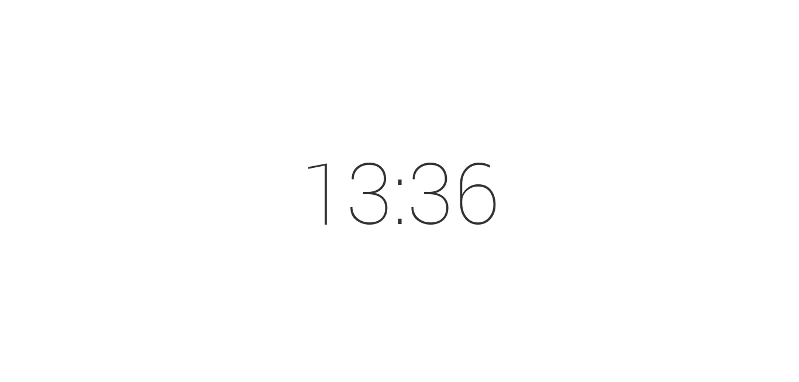
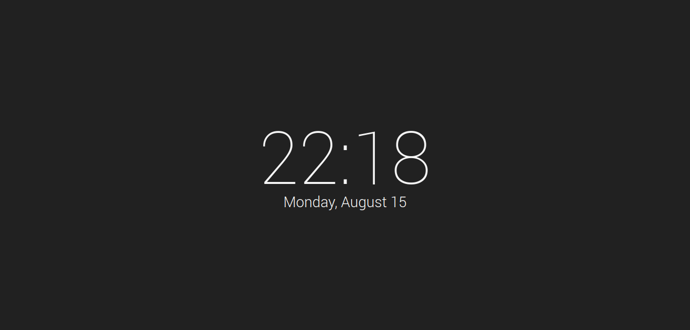
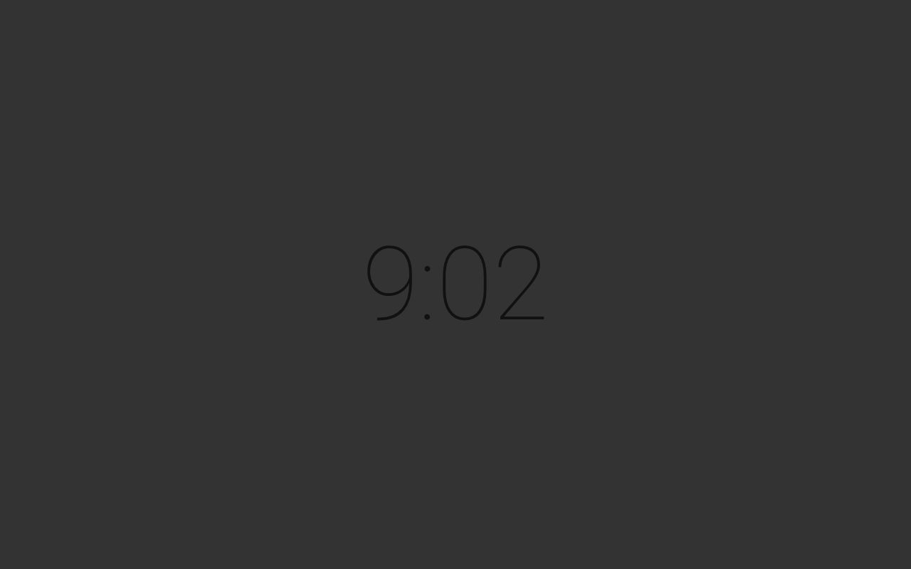
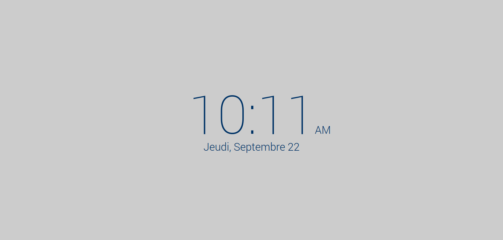
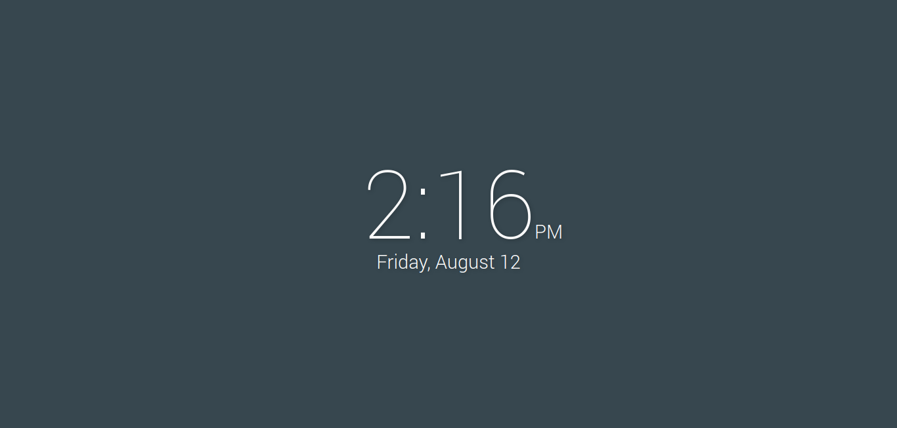
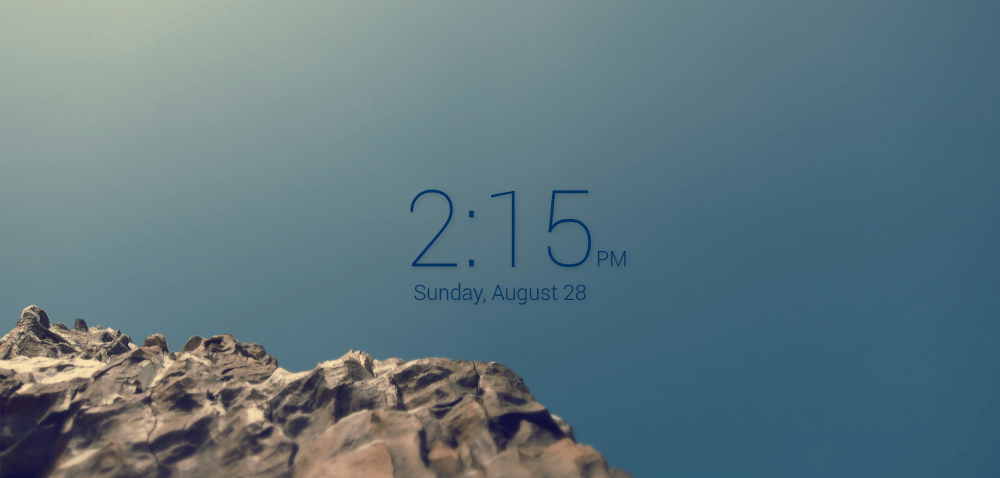

# BW New Tab Page
Minimalist New Tab page for Chromium.

## Features
* 12 and 24-hour digital clocks
* Date (can be hidden or shown)
* 5 beautiful themes: light, night, (full) dark, material and light blue
* Option to rotate between light and night themes based on time of day
* Custom background pictures _(Not recommended sizes > 1MB)_
* Available in some languages aside from English

## Installation
### From source _(Recommended)_
1. Clone or download files inside a folder.
2. Open Chromium extensions page and activate Developer Mode.
3. Click on `Load unpacked extension`, locate the extension folder and click open.
4. If you like, click options to go to the configuration page.

### Packaged version
1. Download our latest packaged `.crx` from [here](../../releases/latest).
2. Open Chromium extensions page.
3. Drag and drop the `.crx` there and proceed with installation.
4. If you like, click options to go to the configuration page.

### Google Chrome Web Store
The packaged Google Chrome extension is available [here](https://chrome.google.com/webstore/detail/doiinciigjmmlnbehjjjkeoamihggkba).

This extension should work out of box. Settings can be configured in the Options link visible in the extensions menu.

## Contributing
1. Install [npm](https://www.npmjs.com/) on your system.
2. Install npm packages into your project. Go to the project directory and execute `npm install`.
3. Execute `grunt`, that will minify your files.
4. Submit a [GitHub pull request](../../pulls) with your modified and generated minified files too.

> Don't edit minified files, grunt will override them automatically.

--------------------------------------------------------------------------------

## License
This program is free software and is licensed under GNU GPLv2.

	Minimalist New Tab page for Chromium.
	Copyright (C) Germán Franco Dorca
	Designed by Erik Boesen

	This program is free software; you can redistribute it and/or modify
	it under the terms of the GNU General Public License as published by
	the Free Software Foundation; either version 2 of the License, or
	(at your option) any later version.

	This program is distributed in the hope that it will be useful,
	but WITHOUT ANY WARRANTY; without even the implied warranty of
	MERCHANTABILITY or FITNESS FOR A PARTICULAR PURPOSE.  See the
	GNU General Public License for more details.

	You should have received a copy of the GNU General Public License along
	with this program; if not, write to the Free Software Foundation, Inc.,
	51 Franklin Street, Fifth Floor, Boston, MA 02110-1301 USA.
