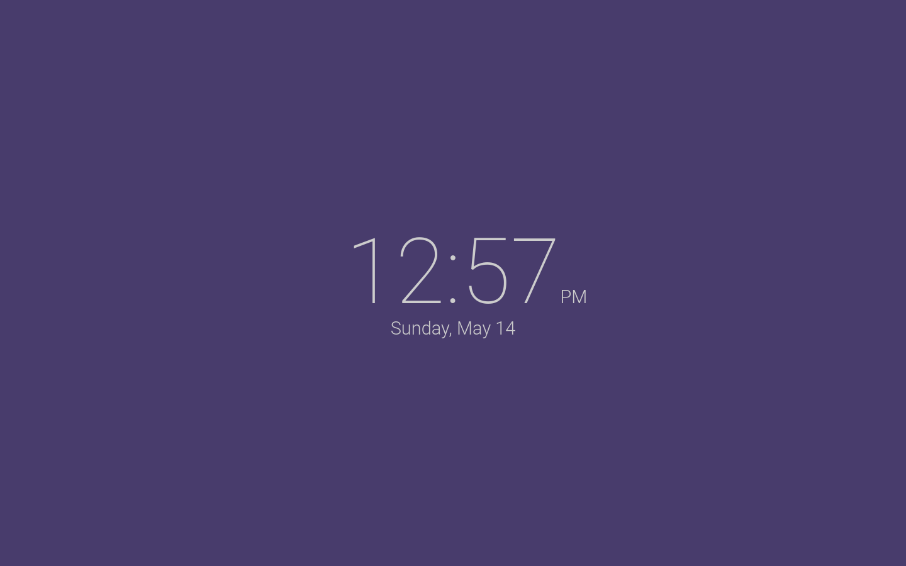

# BW New Tab Page

Minimalist New Tab page extension. Supports all modern browsers.





## Features

- 12 and 24-hour digital clocks
- Date (can be hidden or shown)
- 5 beautiful themes: light, night, dark, material, light blue, light purple
- Option to rotate between light and night themes based on time of day
- Custom background pictures _(Image sizes >1MB not recommended)_
- Available in some languages aside from English

## Installation

### From source

Follow [these instructions](http://www.techradar.com/news/software/install-firefox-chrome-and-opera-extensions-manually-1321636) to install this extension from source.

### Web Stores

The packaged extension is available on several web stores:

- [Chrome](https://chrome.google.com/webstore/detail/doiinciigjmmlnbehjjjkeoamihggkba)
- [Firefox](https://addons.mozilla.org/en-US/firefox/addon/bwnt)

> This extension should work out of box. Settings can be configured in the _Options_ link visible in the extensions menu.

## Contributing

Contributions are accepted via [GitHub pull requests](../../pulls).

To add a translation copy the `en` folder inside `_locales` and change the folder name to the new locale code.
After translation, add your name and email into the CONTRIBUTORS file or in the TRANSLATORS file.

### Building

To build for distribution, run

```sh
npm run build
```

Your zipped package will be available at `./archive.zip`.

---

## License

This program is free software and is licensed under GNU GPLv3.

    Minimalist New Tab page for all browsers.
    Copyright (C) Erik Boesen, Germán Franco Dorca

    This program is free software: you can redistribute it and/or modify
    it under the terms of the GNU General Public License as published by
    the Free Software Foundation, either version 3 of the License, or
    (at your option) any later version.

    This program is distributed in the hope that it will be useful,
    but WITHOUT ANY WARRANTY; without even the implied warranty of
    MERCHANTABILITY or FITNESS FOR A PARTICULAR PURPOSE.  See the
    GNU General Public License for more details.

    You should have received a copy of the GNU General Public License
    along with this program.  If not, see <https://www.gnu.org/licenses/>.
