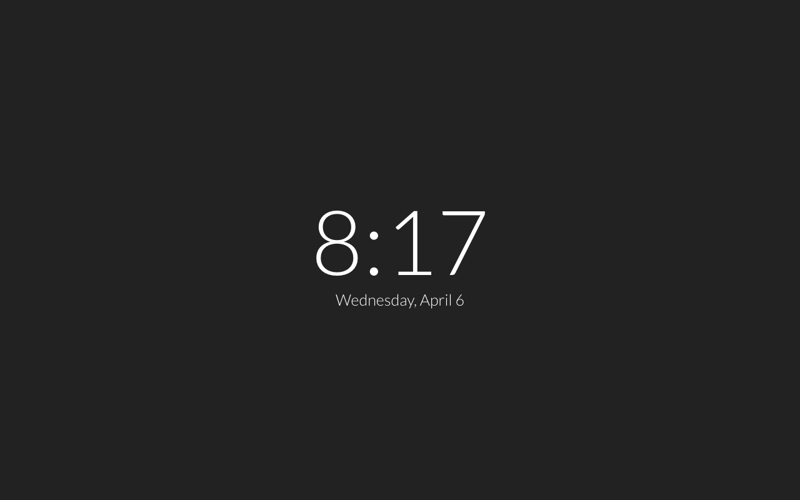
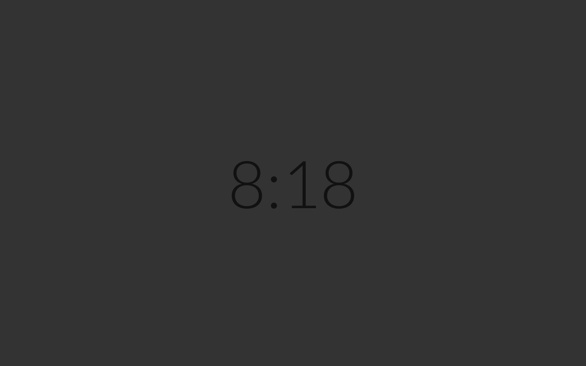
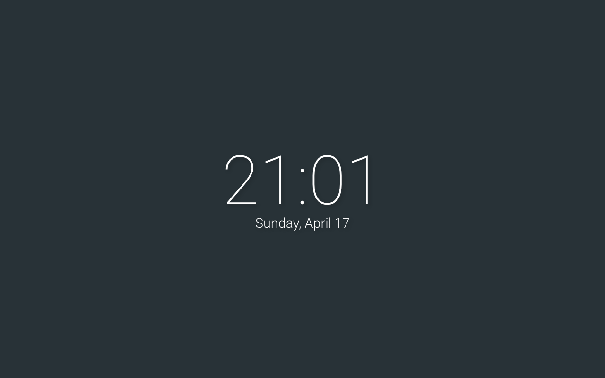

# BW New Tab Page
   

Gorgeous hyperminimalistic black & white New Tab Page.

## Features
* 12- and 24-hour time
* Date (can be hidden or shown)
* 4 beautiful themes: light, night, (full) dark, and material
* Option to rotate between light and night themes based on time of day

## Installation
The packaged Chrome extension is available [here](https://chrome.google.com/webstore/detail/doiinciigjmmlnbehjjjkeoamihggkba).  
To install from source:  
1. Clone or download files.  
2. Open Chrome Extensions page and activate Developer Mode.  
3. Load Unpacked Extension, and locate the extension folder.  
4. Select the folder and click open.  
5. If you like, click options to go to the configuration page.  

This extension should work out of box. Settings can be configured in the Options link visible in the extensions menu.

--------------------------------------------------------------------------------

This project is protected under Creative Commons 0. Basically, do whatever you want with it. I'd like if you gave me credit, but you don't _have_ to.
